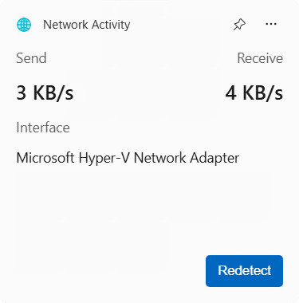
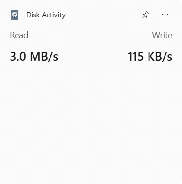

# System Activity Widgets

Windows11 widgets for displaying system activity information:

- Network Activity Widget
  
  Monitoring send and receive network speed.

  

- Disk Activity Widget
  
  Monitoring disk read and write speed.

  